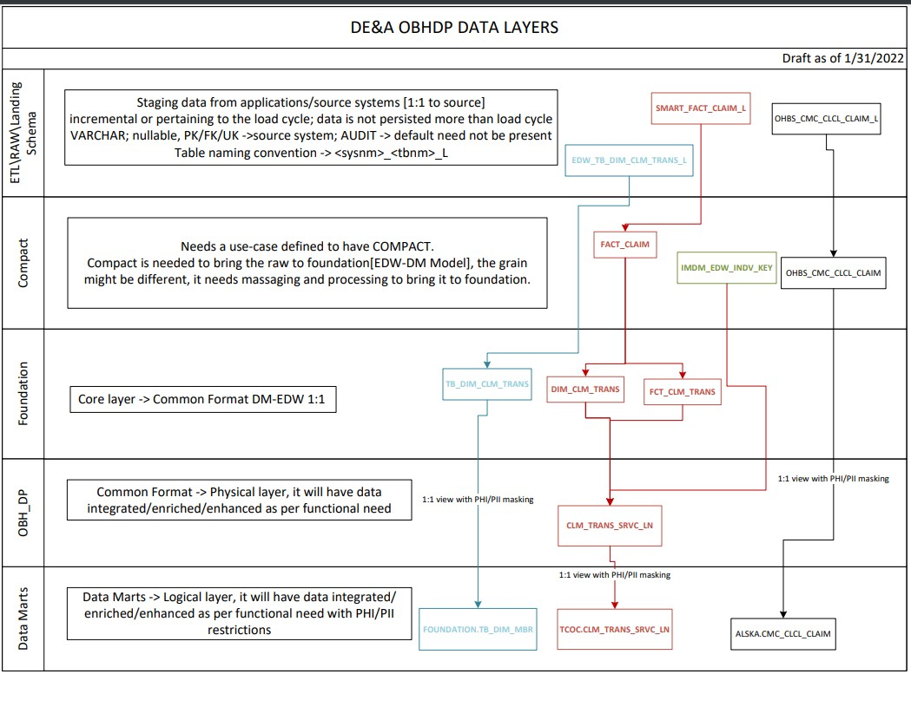
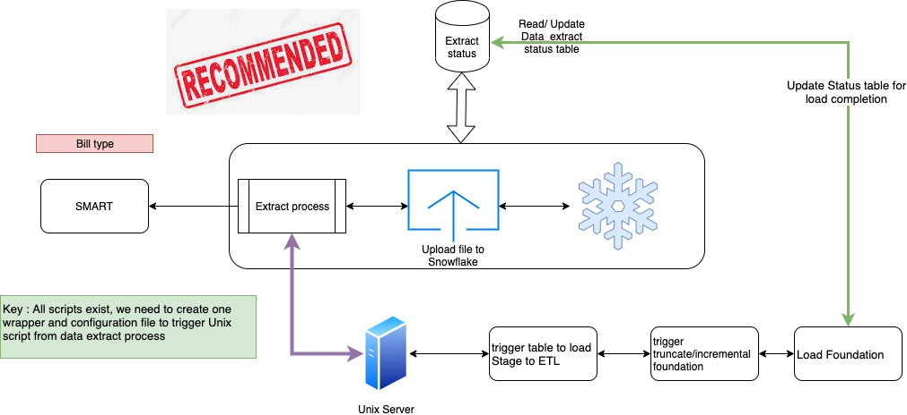

# TCOC 

This repository is used for TCOC Data Loads. Scripts are created to move the data from SMART to SnowFlake and load data using automated filewatcher into Snowflake STAGE/ETL & Foundation layer.

After the load of external systems is complete, the final step is to convert the claims into Med/RX common format tables.

The TCOC layer implement the security for PHI/PII data, and integrates with Enterprise Individual and Enterprise Provider.

### Repository Access
Raise a secure request to obhdp_github_read/obhdp_github_write group for the read/write access.

### TCOC

