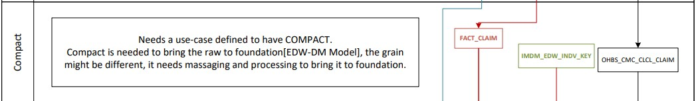

# COMPACT layer 
## GitHub
This folder stores the necessary files to store 1-1 tables coming from SMART. EDW or other multiple sources.
###Configs - deprecated. 
This folder was originally intended to store the configurations needed for each environment: DEV, STG, PRD. It was later decided to handle these configurations through a Unix script.
###LOAD
Contains the load scripts, one for each table that we want to move from ETL layer to COMPACT layer:

COMPACT_ = There is one script for each table, and each script contains 2 statements:
DELETE statement for the target table, so that we always have a full table load or refresh
Call to the stored procedure (source and target tables) that executes the MERGE statement and produces the audit data for the load into the target table

###Tables
Contains the DDL for the SMART/EDW/Other tables in Snowflake. Please refer to the Snowflake_Model_Standards.docx document located at the root of this directory for the rules and best practices when creating the DDL for any table.

### COMPACT layer flow

