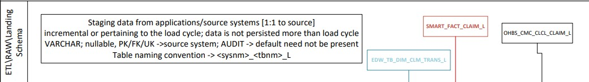

# ETL layer 
## GitHub
This folder stores the necessary files to upload data after the first csv files arrive from the Megatron application, into the Snowflake staging area.
###Configs - deprecated. 
This folder was originally intended to store the configurations needed for each environment: DEV, STG, PRD. It was later decided to handle these configurations through a Unix script.
###LOAD_ETL
Contains 2 types of files for each table imported from the source:

DEL_ = contains the DELETE statement, one for each table, needed to execute before the csv files are loaded into the ETL tables

SMART_ or EDW_ = contains the COPY command script, one for each table, needed to load from Snowflake's staging area into each table located in the ETL layer

###Tables
Contains the DDL for tables needed to config, audit, and control the extract and load process.
Contains the DDL for the tables where the extract csv files land into Snowflake. Please refer to the Snowflake_Model_Standards.docx document located at the root of this directory for the rules and best practices when creating the DDL for data loads.
###Stored Procedures

ETL.DBA_IMDM_CDC = When this procedure is executed, it executes a query against the ECT_ENV_INDIVIDUAL_DB, 7 tables, and looks up for the most recent changes that happened on those tables. The driver of this look up is last changed date (field name varies from iMDM table to table).

ETL.DBA_MERGE = Receives three parameters, source table, target table, and the type of load: Incremental or Historical. This stored procedure will look up the merge statement to execute for the source-target passed, and execute it. At the end, it will log the results of the load process.

ETL.DBA_MERGE_IMDM_INDV_KEY = Receives three parameters, source table, target table, and the type of load: Incremental or Historical. This stored procedure generates a flat version of IMDM data taken from ECT_ENV_INDIVIDUAL_DB, COMPACT.IMDM_INDV_KEY table. Brings over the active records.

###Static Data
Each file located in this folder will contain static data needed for data extracts, or merge statements, or config data.

###SF_File_Frmt_iStage

File formats: One script is created for the file formats we need for each source

Stages: one script is used to generate one Stage folder in Snowflake, for each extracted table

### Extract and load to raw layers

