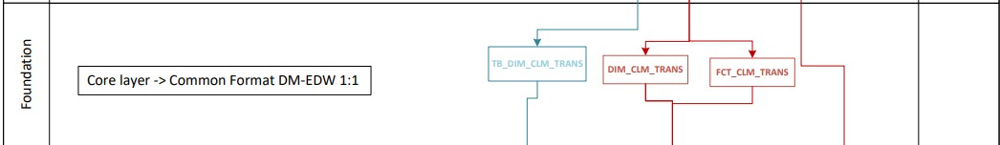

# FOUNDATION layer 
## GitHub
This folder stores the necessary files to store core or common format data from multiple sources.
###Configs - deprecated. 
This folder was originally intended to store the configurations needed for each environment: DEV, STG, PRD. It was later decided to handle these configurations through a Unix script.
###LOAD
Contains the load scripts, one for each table that we want to move from COMPACT layer to the FOUNDATION (core or common format) layer:

FOUND_ = There is one script for each table, and each script contains 2 statements:
DELETE statement for the target table, so that we always have a full table load or refresh
Call to the stored procedure (source and target tables) that executes the MERGE statement and produces the audit data for the load into the target table

###Tables
Contains the DDL for the core or common format tables in Snowflake. Please refer to the Snowflake_Model_Standards.docx document located at the root of this directory for the rules and best practices when creating the DDL for any table.
###Views

These are internal, auxiliary views needed to implement the logic for the Claims (MD/RX) common format, or to integrate the same claims with external sources (example: Enterprise Individual or Enterprise Provider) 

### FOUNDATION layer flow

