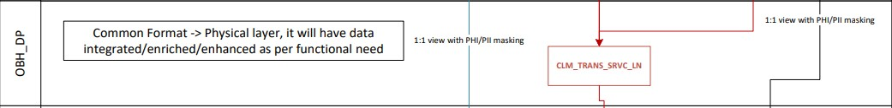

# OBH_DP layer 
## GitHub

This folder stores the necessary files to store common format tables for Medical and RX claims, additionally any other dimension or fact table to enhance common format claims usability, like member coverage or NDC codes.

The common format tables in this layer are already integrated with external sources like Enterprise Individual or Enterprise Provider.

###LOAD
Contains the load scripts, one for each table that we want to process from COMPACT layer to OBH_DP layer:

OBH_DP_ = There is one script for each table, and each script contains 2 statements:
DELETE statement for the target table, so that we always have a full table load or refresh
Call to the stored procedure (source and target tables) that executes the MERGE statement and produces the audit data for the load into the target table

###Tables
Contains the DDL for the common format tables in Snowflake. Please refer to the Snowflake_Model_Standards.docx document located at the root of this directory for the rules and best practices when creating the DDL for any table.

### OBH_DP layer flow

