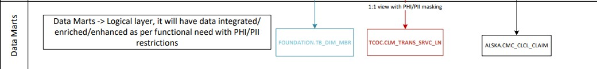

# TCOC layer 
## GitHub

This folder stores the necessary files to create the views exposed to the consumers for Medical and RX claims, and views to data from external systems

The views in this layer, are enforcing the security required for PHI/PII where only specific roles can see the fields identified as personal information.

###Views

Contains the DDL for the views in Snowflake:

Common format views for Medical and RX claims, security implemented, and point to a DM table to ensure no disruptions to the business during the load process

Provider views, security implemented

IMDM views, security implemented

### TCOC layer flow

